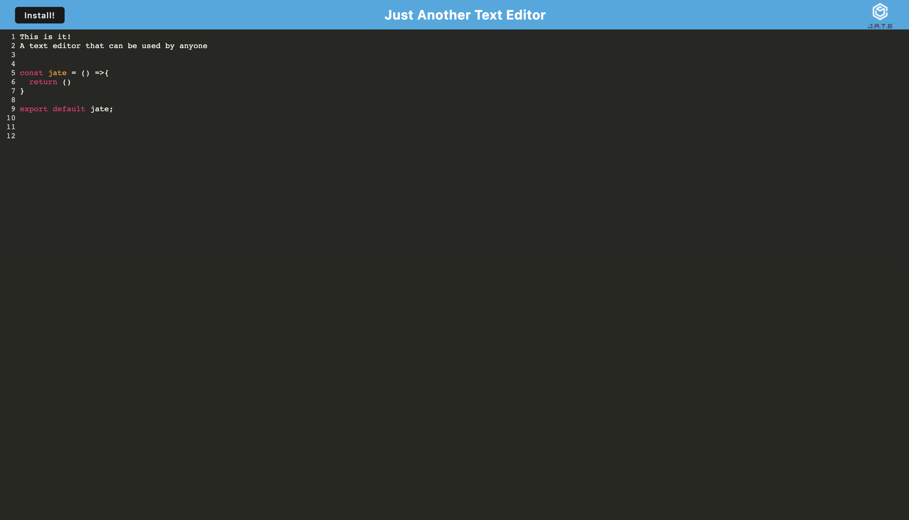

# Text Editor

## Badges

## Description
This is a text editor that can be used for for multiple purposes. It can be used even offline because it is a Progressive Web Application. Users can download the app and have it work on their devices no matter the situation.

## Table of Contents
- [Installation](#installation)
- [Usage](#usage) 
- [License](#license)
- [Information](#information)

## Installation
The first thing users have to do is clone the app from the repository. Then, they have to run few commands on the dedicated terminal. The first command is `npm install ` or `npm i` for short. 
Next, they have to run `npm run build` and when this is done run the last command `npm run start:dev` to start the app

## Usage
Users can access the deployed app [here](https://the-text-editor.herokuapp.com/)
## License

## Information
- Rim Zoungrana
- github.com/Shalah

